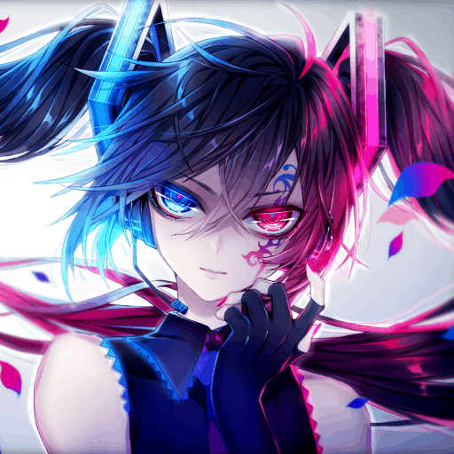
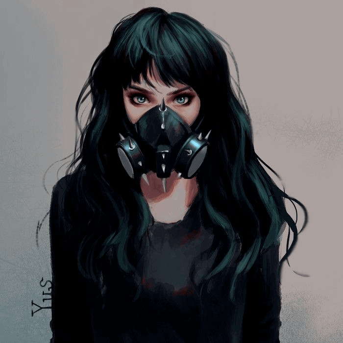

<html lang="en">
<head>
    <meta charset="UTF-8">
    <meta http-equiv="X-UA-Compatible" content="IE=edge">
    <meta name="viewport" content="width=device-width, initial-scale=1.0">
    <title>Bit Criminals</title>
    <link rel="icon" type="image/png" sizes="64x64" href="images/myfavicon.png">
    <link rel="stylesheet" href="https://unpkg.com/flickity@2/dist/flickity.min.css">
    <link rel="stylesheet" href="css/global.css">
    <link rel="stylesheet" href="css/index.css">
</head>
<body>
    

    
    <main>
        

            

                

                    

                    

                

                

                    
                

            

            

                Criminal Group: 57005
            

        

        

        

            

            

                

                    Plan #34
                

            

            

                

                    About Us
                

                

                    We really are just a bunch of people who like committing crimes.
                    <ul class="social-links">
                        <li>

</li>
                        <li>

</li>
                    </ul>
                

            

        

        

            

            

                

                    Our Crime Reports
                

                

                    

                        
                            
                                <a href="/{{ ctf.label }}" class="writeup-grid-cell carousel-cell">
                                    

                                    
{{ ctf.title }}

                                </a>
                            
                        
                    

                    <!-- <a href="">
                        <button>See All Reports!</button>
                    </a> -->
                

            

        

        

            

            

                

                    Our Criminals
                

                

                    

                        

                            

                                
                                

                                    

                                        <ul class="social-media-links">
                                            <li></li>
                                            <li></li>
                                        </ul>
                                    

                                

                            

                            
ReversedEyes

                        

                        

                            

                                
                                

                                    

                                        <ul class="social-media-links">
                                            <li></li>
                                            <li></li>
                                        </ul>
                                    

                                

                            

                            

                            
MaskdMafia

                        

                        

                            

                                

                                    

                                        <ul class="social-media-links">
                                            <li></li>
                                            <li></li>
                                        </ul>
                                    

                                

                            

                            
justanothernoob

                        

                        

                            

                                

                                    

                                        <ul class="social-media-links">
                                            <li></li>
                                            <li></li>
                                        </ul>
                                    

                                

                            

                            
Dr.D0NN4

                        

                        

                            

                                

                                    

                                        <ul class="social-media-links">
                                            <li></li>
                                            <li></li>
                                        </ul>
                                    

                                

                            

                            
v1per

                        

                        

                            

                                

                                    

                                        <ul class="social-media-links">
                                            <li></li>
                                            <li></li>
                                        </ul>
                                    

                                

                            

                            
Alphx

                        

                        

                            

                                

                                    

                                        <ul class="social-media-links">
                                            <li></li>
                                            <li></li>
                                        </ul>
                                    

                                

                            

                            
Dark Demian

                        

                        

                            

                                

                                    

                                        <ul class="social-media-links">
                                            <li></li>
                                            <li></li>
                                        </ul>
                                    

                                

                            

                            
Otaku_

                        

                        

                            

                                

                                    

                                        <ul class="social-media-links">
                                            <li></li>
                                            <li></li>
                                        </ul>
                                    

                                

                            

                            
Leo

                        

                    

                

            

        

    </main>
    
    

    

    
    
    
    
    
</body>
</html>
