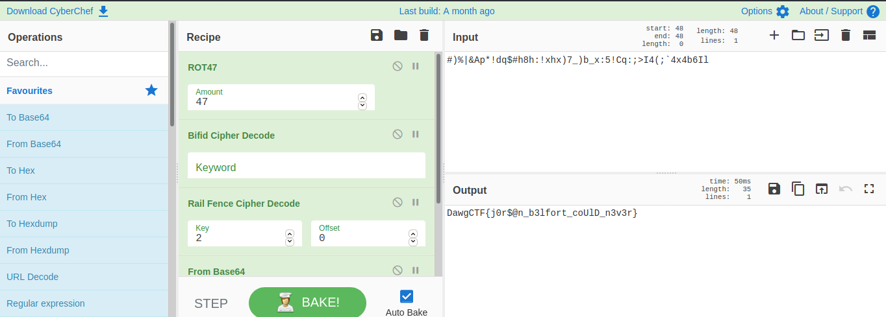

We are given with this text:
``` #)%|&Ap*!dq$#h8h:!xhx)7_)b_x:5!Cq:;>I4(;`4x4b6Il ```
Since it looks like gibbrish text so it must be `ROT47` and then it was `BIFID CIPHER` and then `RAIL FENCE CIPHER` and finally `BASE64`
So the order is :
```
* ROT47
* BIFID CIPHER
* RAIL FENCE CIPHER
* BASE64 DECODE
```
You can directly obtain the flag from this [link](https://gchq.github.io/CyberChef/#recipe=ROT47(47)Bifid_Cipher_Decode(%27%27)Rail_Fence_Cipher_Decode(2,0)From_Base64(%27A-Za-z0-9%2B/%3D%27,true)&input=IyklfCZBcCohZHEkI2g4aDoheGh4KTdfKWJfeDo1IUNxOjs%2BSTQoO2A0eDRiNkls)



THE FLAG `DawgCTF{j0r$@n_b3lfort_coUlD_n3v3r}`
But there was some error in the flag i don't know why but by luck i got the right flag!!
```DawgCTF{j0rd@n_b3lfort_coUlD_n3v3r}```


