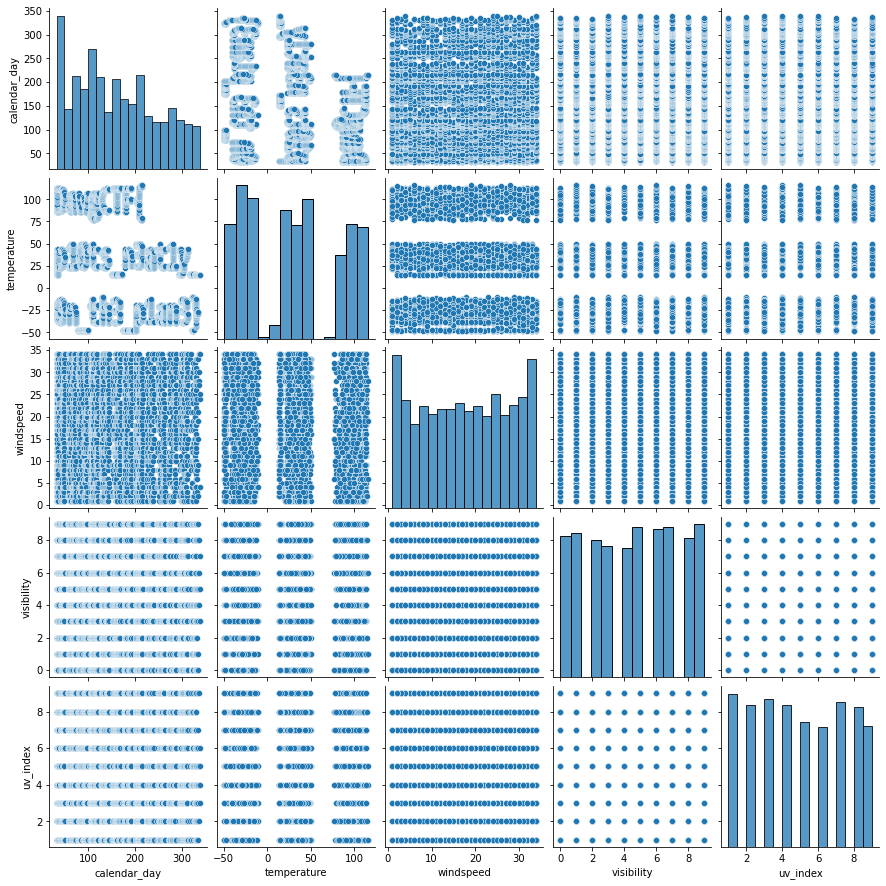
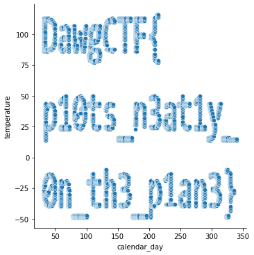

Let's open the given CSV with pandas and try to analyse the data.

```python
import pandas as pd
import seaborn as sns

data = pd.read_csv("spain.csv")
data.info()
```

```
<class 'pandas.core.frame.DataFrame'>
RangeIndex: 3750 entries, 0 to 3749
Data columns (total 5 columns):
 #   Column        Non-Null Count  Dtype
---  ------        --------------  -----
 0   calendar_day  3750 non-null   int64
 1   temperature   3750 non-null   int64
 2   windspeed     3750 non-null   int64
 3   visibility    3750 non-null   int64
 4   uv_index      3750 non-null   int64
dtypes: int64(5)
memory usage: 146.6 KB
```

Plotting all the graphs to see if something useful is present.
```python
sns.pairplot(data)
```


The plot between temperature and calendar_day looks like the flag.

```python
sns.relplot(x=data['calendar_day'], y=data['temperature'])
```



`DawgCTF{p10ts_n3atqy_0n_th3_p1an3}`

