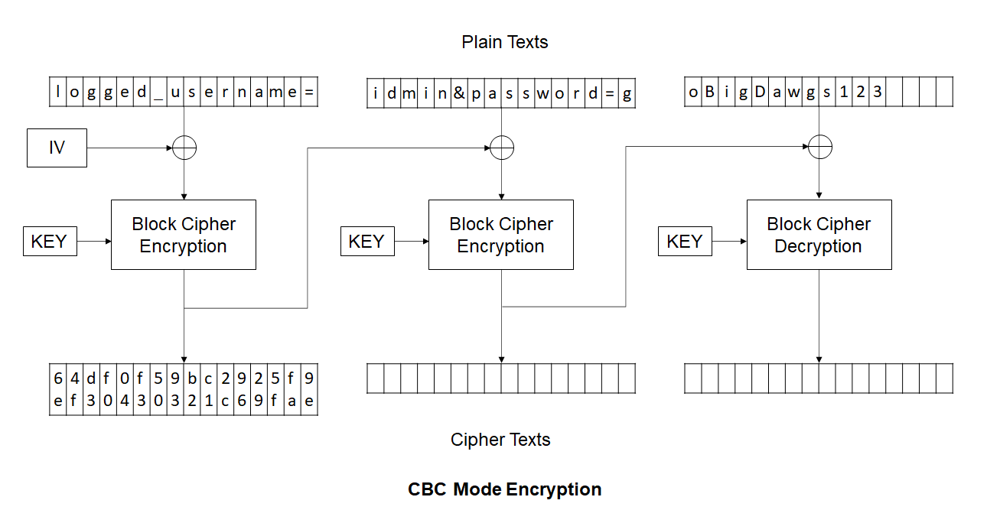
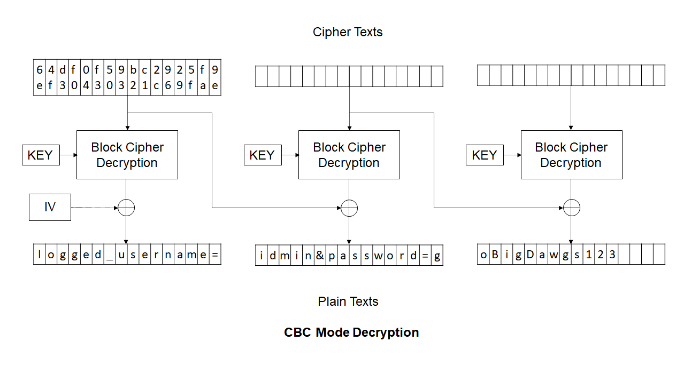
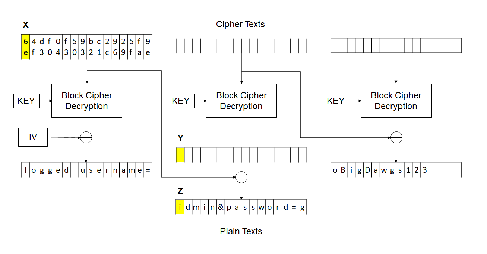

We are given a server and the prompt says it has a vulnerability. The given `app.py` file shows the internal working of server.


`app.py`
```python
import socketserver
import socket, os
from Crypto.Cipher import AES
from Crypto.Util.Padding import pad,unpad
from Crypto.Random import get_random_bytes
from binascii import unhexlify
from secret import FLAG


wlcm_msg ='########################################################################\n'+\
		  '#                            Welcome                                   #\n'+\
		  '#             All connections are monitored and recorded               #\n'+\
		  '#      Disconnect IMMEDIATELY if you are not an authorized user!       #\n'+\
		  '########################################################################\n'


key = get_random_bytes(16)
iv = get_random_bytes(16)


def encrypt_data(data):
	padded = pad(data.encode(),16,style='pkcs7')
	cipher = AES.new(key, AES.MODE_CBC,iv)
	enc = cipher.encrypt(padded)
	return enc.hex()

def decrypt_data(encryptedParams):
	cipher = AES.new(key, AES.MODE_CBC,iv)
	paddedParams = cipher.decrypt( unhexlify(encryptedParams))
	print(paddedParams)
	if b'admin&password=goBigDawgs123' in unpad(paddedParams,16,style='pkcs7'):
		return 1
	else:
		return 0

def send_msg(s, msg):
	enc = msg.encode()
	s.send(enc)

def main(s):

	send_msg(s, wlcm_msg)

	send_msg(s, 'username: ')
	user = s.recv(4096).decode().strip()

	send_msg(s, user +"'s password: " )
	passwd = s.recv(4096).decode().strip()

	msg = 'logged_username=' + user +'&password=' + passwd

	try:
		assert('admin&password=goBigDawgs123' not in msg)
	except AssertionError:
		send_msg(s, 'You cannot login as an admin from an external IP.\nYour activity has been logged. Goodbye!\n')
		raise

	send_msg(s, "Leaked ciphertext: " + encrypt_data(msg)+'\n')
	send_msg(s,"enter ciphertext: ")

	enc_msg = s.recv(4096).decode().strip()

	try:
		check = decrypt_data(enc_msg)
	except Exception as e:
		send_msg(s, str(e) + '\n')
		s.close()

	if check:
		send_msg(s, 'Logged in successfully!\nYour flag is: '+ FLAG)
		s.close()
	else:
		send_msg(s, 'Please try again.')
		s.close()


class TaskHandler(socketserver.BaseRequestHandler):
	def handle(self):
		main(self.request)

if __name__ == '__main__':
	socketserver.ThreadingTCPServer.allow_reuse_address = True
	server = socketserver.ThreadingTCPServer(('0.0.0.0', 3000), TaskHandler)
	server.serve_forever()
```

As visible from the file, we have the credentials user:admin and pw:goBigDawgs123 but directly entering these is restricted. Also, the cipher used here is AES in CBC Mode and `'logged_username='` is added at the beginning.

This complete setup is vulnerable to **Bit Flipping Attack**.

### Bit Flipping Attack

In CBC Mode, the ciphertext of previous block is XORed with the decrypted ciphertext of current block to obtain the plaintext. So, if we change something in the ciphertext of previous block, it will be reflected in the obtained plaintext. Following two images will explain the encryption and decryption process.








Consider the following image and note the symbols used to represent highlighted bytes.



As we saw in app.py `logged_username=` is not used while checking for credentials. The program only checks if `admin&password=goBigDawgs123` is present in the decrypted text.

Using little bit of mathematics here (`^` is `XOR` operation):-

***Z = X ^ Y => Y = Z ^ X***

We want Z' ('a') at the position of Z which is currently an 'i'. And to bring about this change we are allowed to alter X. Let's say we change it to X'.

***Z' = X' ^ Y => X' = Z' ^ Y***

***X' = Z' ^ (Z ^ X)***

For this particular case:

***X' = ord('a') ^ ord('i') ^ 6e***

```python
>>> x = int('6e', 16) #converting hex to decimal
>>> x_= ord('a') ^ ord('i') ^ x
>>> hex(x_) #converting back to hex
'0x66'
```

Now we know that replacing first 2 digits of leaked ciphertext (`6e` with `66`) will change the `i` i.e. first character of 2nd plaintext block to `a` and this will have no effect on next blocks. Also, `logged_username=` has no role in validation as explained above.


```
$ nc umbccd.io 3000
########################################################################
#                            Welcome                                   #
#             All connections are monitored and recorded               #
#      Disconnect IMMEDIATELY if you are not an authorized user!       #
########################################################################
username: idmin
idmin's password: goBigDawgs123
Leaked ciphertext: 6e4fd3f004fe5093b2c12c96295ffa9ea83d6e65528df6df42ffd56b4f9cf23f0d4f6f9a1dc04cad30566b21f15f16ca
enter ciphertext: 664fd3f004fe5093b2c12c96295ffa9ea83d6e65528df6df42ffd56b4f9cf23f0d4f6f9a1dc04cad30566b21f15f16ca
Logged in successfully!
Your flag is: DawgCTF{F1ip4J0y}
```